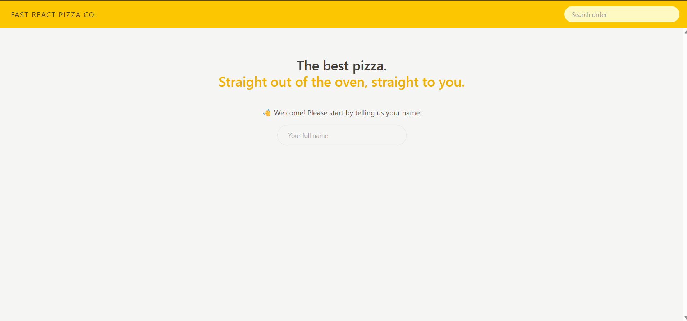
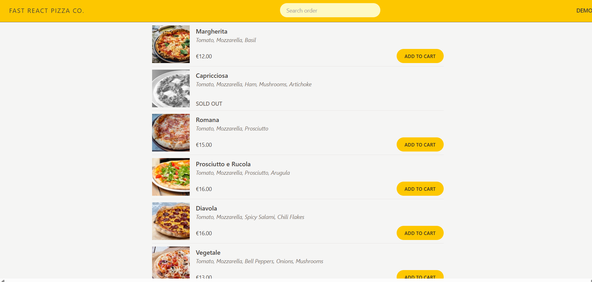
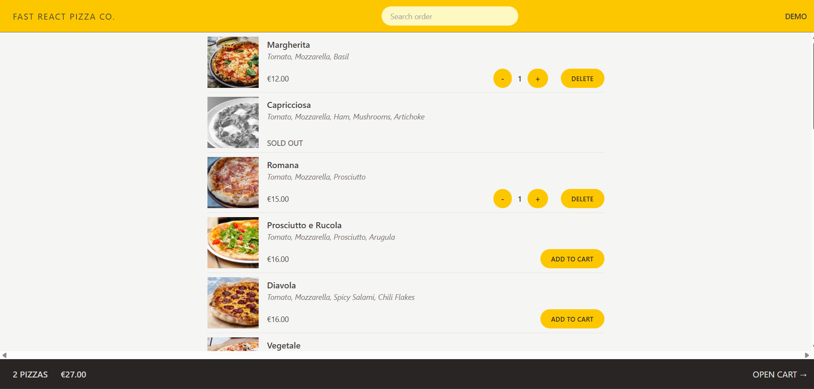
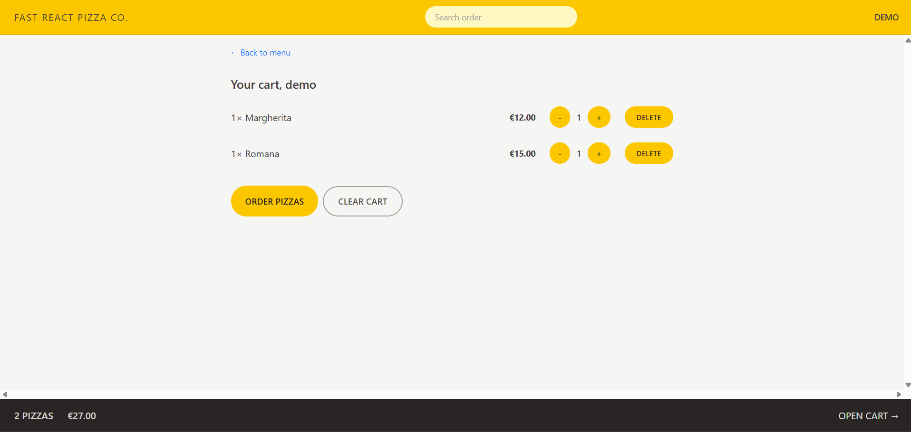
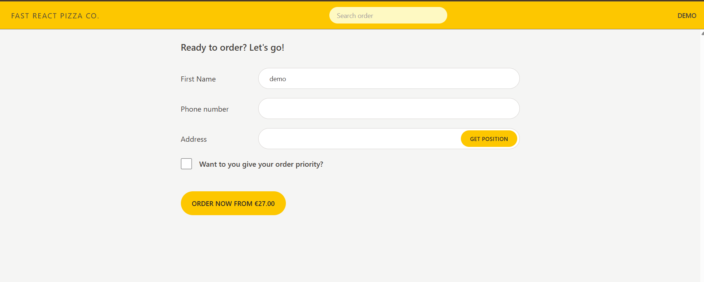
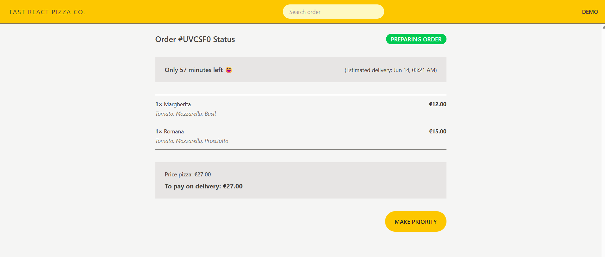

 

<h1>Fast-React-Pizza Web Application build using ReactJS, TailwindCSS, Redux, Vue.JS</h1>

Working of the application

1. Home Page
   
   --> Here user need to enter their name.

2. Pizza's Menu Page
   

3. Adding favourite pizzas to the cart with required quantity
   

4. Cart Page
   

5. Order Page
   
   --> Here user need to enter details for ordering and can choose priority

6. Order Confirmation Page
   
